```mermaid
---
config:
  theme: base
---
gitGraph BT:
    checkout main
    commit id: "My first commit 🎉" 
```

```mermaid
---
config:
  theme: base
---
gitGraph BT:
    checkout main
    commit id: "My first commit 🎉"
    commit id: "Add moar features"
    commit id: "Adjust the vibe"
    commit id: "Fix issue #404" 
```

## Using Git in <br> **single-player** mode

---

````md magic-move

```sh
# Turn your folder into a git repository
git init
```

```sh
# Turn your folder into a git repository
git init

# edit your files
```

```sh
# Turn your folder into a git repository
git init

# edit your files

# create a new "save point"
git add . 
```

```sh
# Turn your folder into a git repository
git init

# edit your files

# create a new "save point"
git add .
git commit -m "My first commit 🎉"
```

```sh
# all you need to remember
git init
git add . 
git commit
```
````

---
class: text-center pt-47
transition: fade
---



---
class: text-center
---



---
layout: split
transition: slide-left
---

## Restoring a save point

````md magic-move

```sh
# see your commit history
git log
```

```sh
# see your commit history
git log --graph --decorate --abbrev-commit --pretty=oneline 
```

```sh 
# see your commit history
git log

# pick a commit hash
git checkout < commit-hash >
```

```sh 
# see your commit history
git log

# go back to the latest commit
git checkout main
```

```sh 
# see your commit history
git log

# go back to the commit before that
git checkout main^1
```

```sh 
# see your commit history
git log

# reset your actual branch
git reset main^1
```

```sh
# all you need to remember
git log 
git checkout
git reset 
```
````

::bottom::


<div v-click.hide="6">

<div v-click.hide="5" class="absolute bottom-10 left-50">

</div>

<div v-click="[5]" class="absolute bottom-10 left-50">

</div>

<v-drag-arrow pos="310, 12,-56,0"
v-motion
:initial="{y: -200}"
:click-2="{y: -100, transition: {delay: 800}}"
:click-3="{y: -200, transition: {delay: 800}}"
:click-4="{y: -150, transition: {delay: 800}}"
/>

</div>

---
layout: cover
class: text-center
background: https://media2.giphy.com/media/v1.Y2lkPTc5MGI3NjExa2dtMnV3djl1aWhhcXN2NDJ6aHRjM2txMmM5Zm14N2Q3b3BoYXl6dyZlcD12MV9pbnRlcm5hbF9naWZfYnlfaWQmY3Q9Zw/v4hXkjXZAuMW5VfReA/giphy.gif 
---

## **Split reality**

---
layout: split
clicks=6
---
## Branching 

````md magic-move
```sh
```

```sh
git branch feature
```

```sh
git branch feature
git checkout feature
```

```sh
git branch feature
git switch feature
```

```sh
git branch feature
git switch feature

git commit
```

```sh
git branch feature
git switch feature

git commit
git commit
```

```sh
git branch feature
git switch feature

git commit
git commit

git switch main
```

```sh
git branch feature
git switch feature

git commit
git commit

git switch main
git merge feature
```

```sh
# all you need to remember
git branch 
git switch
git merge 
```
````

<v-drag-arrow pos="165,422,-56,0"
style="z-index: 1000"
v-motion
:initial="{x: 0, y: 0, opacity: 1 }"
:click-2="{x: 40}"
:click-4="{x: 70, y: -50}"
:click-5="{x: 70, y: -100}"
:click-6="{opacity: 0}"
/>

<v-drag-arrow pos="20,422,56,0"
style="z-index: 1000"
v-motion
:initial="{x: 0, y: 0, opacity: 0 }"
:click-6="{opacity: 1, transition: {delay: 500}}"
:click-7="{y: -150}"
:click-8="{opacity: 0}"
/>

::bottom::

<div v-click.hide="1" class="absolute bottom-10">


</div>

<div v-click="[1,4]" class="absolute bottom-10">


</div>

<div v-click="[4]" class="absolute bottom-10">


</div>

<div v-click="[5,7]" class="absolute bottom-10">


</div>

<div v-click="[7]" class="absolute bottom-10">


</div>

---
layout: image
backgroundSize: contain
image: https://media4.giphy.com/media/v1.Y2lkPTc5MGI3NjExYTQybmYzZm05OGRjbzhvOThhM3FqYnJrZjRtc2Y5OHY2dXlvNmgycCZlcD12MV9pbnRlcm5hbF9naWZfYnlfaWQmY3Q9Zw/cFkiFMDg3iFoI/giphy.gif 
---

---

## How conflicts are made

<div class="pl-4 pt-8">

</div>

---
layout: section
---
## Conflicts

<div class="text-left">
```
Auto-merging index.html
CONFLICT (content): Merge conflict in index.html
```
</div>

---
layout: image
image: follow-instructions.jpg
backgroundSize: contain
---

---
layout: two-cols
class: flex items-center justify-center flex-col height-full
transition: slide-left
---
Before merge


::right::

<div v-click.hide="1" class="absolute">
After regular merge


</div>

<div v-click="1" class="absolute mt-3.5">
After fast-forward merge

<div class="mt-3.5" ml-5>

</div>
</div>

---
layout: cover
class: text-center
background: https://media4.giphy.com/media/v1.Y2lkPTc5MGI3NjExNTF0b3ZlZzkxbXI3OHV3ZjhhMXBnY2FlZG9wdG82bm0yZ243a2RlaiZlcD12MV9pbnRlcm5hbF9naWZfYnlfaWQmY3Q9Zw/zLPGp6EBG3zrqNXZBT/giphy.gif 
backgroundSize: contain
---

## **Change the flow of time**

---

## Rebasing

---
layout: image
backgroundSize: contain
image: merge.png
---

---