```mermaid
---
config:
  theme: base
---
gitGraph TB:
    checkout main
    commit id: "Ma first commit 🎉" 
```

## Using Git in <br> **single-player** mode

---

````md magic-move

```sh
# Turn your folder into a git repository
git init
```

```sh
# Turn your folder into a git repository
git init

# edit your files
```

```sh
# Turn your folder into a git repository
git init

# edit your files

# create a new "save point"
git add . 
```

```sh
# Turn your folder into a git repository
git init

# edit your files

# create a new "save point"
git add .
git commit -m "add some vibes"
```

```sh
# all you need to remember
git init
git add . 
git commit
```
````

---
class: text-center
transition: fade
---



---
class: text-center
---


---
layout: split
---

## Restoring a save point

````md magic-move
```sh
# see your commit history
git log
```

```sh {all|all}
# see your commit history
git log

# pick a commit hash
git checkout < commit-hash >
```

```sh {all|all}
# see your commit history
git log

# go back to the latest commit
git checkout main
```

```sh
# all you need to remember
git log
git checkout
```
````

::bottom::

```mermaid
---
config:
  theme: base
---
gitGraph TB:
    checkout main
    commit id: "Ma first commit 🎉"
    commit id: "Add vibes"
    commit id: "Fix bugs"
    commit id: "Add documentation"
```

<div class="pl-16" v-click.hide="5">


<v-drag-arrow pos="309,247,-56,-7"
v-motion
:initial="{y:0}"
:click-2="{y: -100}"
:click-4="{y: 0}"
/>

</div>

---
layout: split
---
## Create alternate realities
