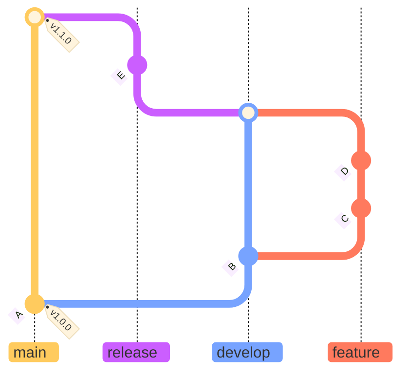
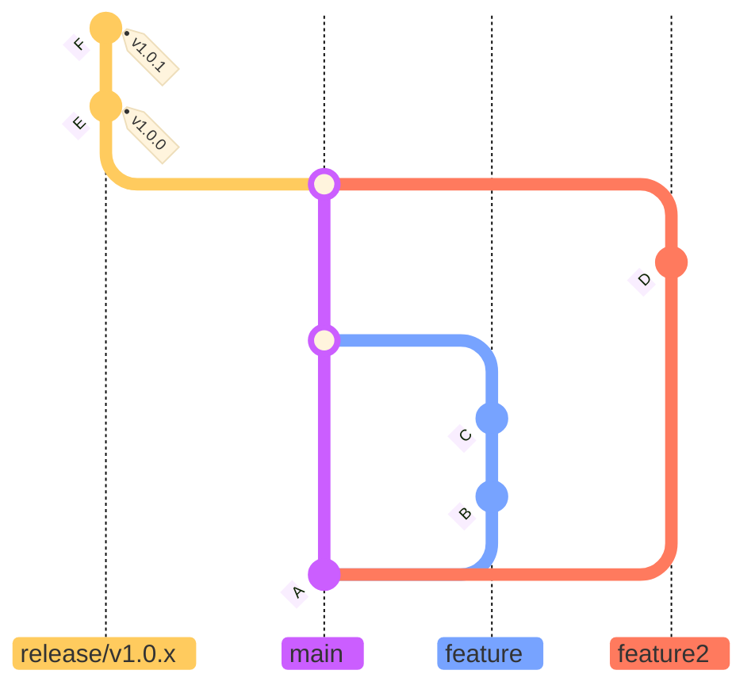

## Using Git in <br> **multi-player** mode

---
layout: center
---


<p class="w-full text-center font-size-10 pb-3">≠</p>

<LightOrDark>
  <template #dark></template>
  <template #light></template>
</LightOrDark>

---

## Talk to a remote repository

````md magic-move
```sh
# Enable multi-player mode
git remote add origin < url >
```

```sh
# Enable multi-player mode
git remote add origin < url >

# First time only
git push --set-upstream origin main
```

```sh
# Enable multi-player mode
git remote add origin < url >

# First time only
git push --set-upstream origin main

# Set repo to remote state
git pull
```

```sh
# Enable multi-player mode
git remote add origin < url >

# First time only
git push --set-upstream origin main

# Set repo to remote state
git pull

# Just fetch without overriding local changes
git fetch
```

```sh
# All you need to remember
git push
git pull
git fetch
```
````

---
layout: image
image: local-remote.png
backgroundSize: contain
---

---
layout: cover
background: https://media2.giphy.com/media/v1.Y2lkPTc5MGI3NjExY3R1c3R3YmgyeTFpc2V1aWRqZG1jcW82bHQyeDZtbnUxZnRndXA4aSZlcD12MV9pbnRlcm5hbF9naWZfYnlfaWQmY3Q9Zw/26tPgV8ceZTSxH9zG/giphy.gif
backgroundSize: contain
---

use the **force**

---

````md magic-move
```sh
# If the history was changed
git push --force
```

```sh
# If the history was changed
git push --force

# Prevent overwriting other's work
git push --force-with-lease
```
````

---
layout: center
transition: fade
---
## Git flow


---
layout: center
---
## Trunk based development

