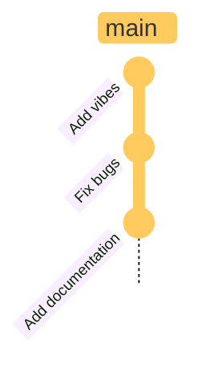

# Git Gud!

A beginner's guide

---
layout: section
---

## Using Git in <br> **single player** mode

---

## How to get started

````md magic-move

```sh
# Turn your folder into a git repository
git init
```

```sh
# Turn your folder into a git repository
git init

# edit your files
```

```sh
# Turn your folder into a git repository
git init

# edit your files

# create a new "save point"
git add . 
```

```sh
# Turn your folder into a git repository
git init

# edit your files

# create a new "save point"
git add .
git commit -m "add some vibes"
```

```sh
# all you need to remember
git init
git add . 
git commit
```
````

---
transition: slide-up
layout: split
---

## Restoring a save point

````md magic-move
```sh
# see your commit history
git log
```

```sh
# see your commit history
git log

# pick a commit hash
git checkout < commit-hash >
```

```sh
# see your commit history
git log

# go back to the latest commit
git checkout main
```

```sh
# all you need to remember
git log
git checkout
```
````

::bottom::

<div class="pl-16" v-click.hide="3">


</div>
